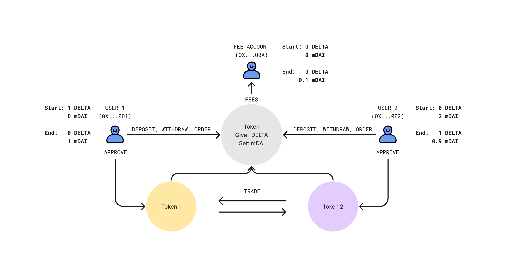

# Delta Token Exchange

This project demonstrates a basic order book based decentralized exchange. It includes a smart contract for the ERC-20 tokens traded on the exchange, as well as the exchange contract that manages deposits/withdrawals and trades on the DEX. Test files and scripts for deployment and seeding the exchange are included.

To test the DEX locally, run the following:
```shell
npx hardhat node

npx hardhat --network localhost scripts/1_deploy.js

npx hardhat --network localhost scripts/2_seed_exchange.js

npm run start
```

The DEX has been deployed on the Sepolia and Mumbai test networks and is configured to service trades for an ERC-20 token, Delta Token (DELTA). DELTA is traded as the base currency in two markets: mETH and mDAI. The mETH and mDAI quote currencies represent mock versions of the Ether and Dai cryptocurrencies. The exchange contract takes a fee percent parameter upon deployment, which is paid by the user filling an order on the exchange - the taker. The test deployment has used a 10% fee for simplicity.


